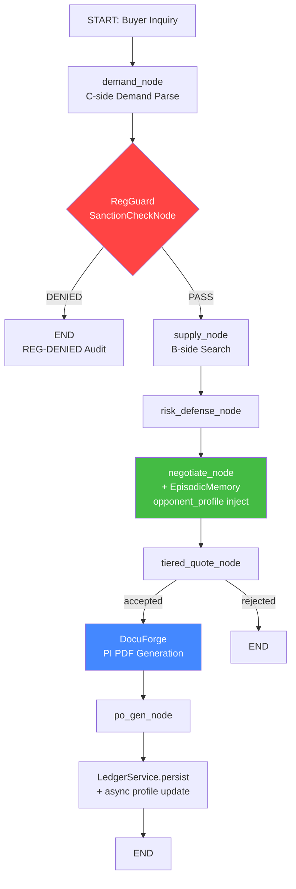

# Global Trade Fulfillment Loop — Architecture Plan

## Overview

Three new modules to complete the global trade fulfillment closed loop, built on top of the existing Bloomberg Ticker Plant and LangGraph state machine infrastructure.

## Architecture Diagram



## Task 1: RegGuard — Export Control Node

### Files
- `src/modules/compliance/__init__.py` — empty
- `src/modules/compliance/export_control.py` — SanctionCheckNode + ComplianceException
- `src/modules/compliance/embargo_keywords.json` — local blacklist data

### Design
- `ComplianceException` — custom exception for export control violations
- `SanctionCheckNode` — checks demand against local embargo_keywords.json
  - Checks: destination country/port, Ticker prefix patterns, product keywords
  - On hit: raises ComplianceException, state machine routes to END
  - Logs `[REG-DENIED]` via ComplianceGateway audit trail
- Inserted into `matching_graph.py` between `demand_node` and `supply_node`
- New `MatchState` field: `reg_guard_result` with pass/deny status

### embargo_keywords.json structure
```json
{
  "sanctioned_countries": ["North Korea", "Iran", "Syria", "Cuba"],
  "sanctioned_ports": ["Chongjin", "Bandar Abbas"],
  "restricted_ticker_prefixes": ["CLAW-ELEC-IC-MIL", "CLAW-ELEC-XFMR-HV"],
  "dual_use_keywords": ["military", "nuclear", "encryption-grade", "satellite"]
}
```

### Graph Integration
```
demand_node → reg_guard_node → [pass?] → supply_node
                              → [denied?] → END
```

## Task 2: EpisodicMemory — Long-term Opponent Profiling

### Files
- `src/core/long_term_memory.py` — OpponentProfiler + opponent_profiles table

### Design
- New SQLAlchemy model `OpponentProfile` in `database/models.py`:
  - `client_id` PK, `total_negotiations`, `total_accepted`, `total_rejected`
  - `avg_discount_pct`, `avg_counter_rounds`, `last_interaction`
  - `risk_tag` — high_pressure / normal / premium
- `OpponentProfiler` class:
  - `async update_profile(client_id, outcome, discount_pct, rounds)` — called after LedgerService.persist
  - `async get_profile(client_id) -> dict` — returns opponent context for NegotiatorAgent
  - `compute_initial_markup(profile) -> float` — returns price adjustment factor
    - High-pressure clients: +5% initial markup
    - Premium clients: -2% loyalty discount
    - Normal: 0%
- Hook into `LedgerService.persist()` — fire-and-forget async profile update
- Hook into `NegotiatorAgent.execute()` — read profile before evaluation, inject as context

### Negotiator Integration
- Before evaluating candidates, NegotiatorAgent reads opponent_profile
- If client has history of aggressive counter-offers, initial landed_usd is adjusted
- Profile data logged in negotiation_log as `[MEMORY]` entries

## Task 3: DocuForge — Tamper-proof Invoice Engine

### Files
- `src/modules/documents/__init__.py` — empty
- `src/modules/documents/invoice_generator.py` — InvoiceGenerator class
- `src/modules/documents/templates/proforma_invoice.html` — Jinja2 template

### Design
- `InvoiceGenerator` class:
  - `generate_pi(transaction_data) -> dict` — renders Jinja2 HTML template
  - `render_pdf(html_content) -> bytes` — uses Playwright headless to print PDF
  - `hash_and_persist(pdf_bytes, metadata) -> str` — SHA-256 hash + DB persist
- Jinja2 template: professional Proforma Invoice with:
  - Seller/Buyer info, Ticker ID, SKU details, quantity, unit price
  - FX rate snapshot, shipping term, payment term
  - Total in USD and RMB, SHA-256 document hash footer
- New DB model `DocumentHash` in supply_chain/models.py:
  - `document_id`, `document_type`, `file_hash_sha256`, `ticker_id`, `transaction_id`
- Triggered from matching_graph.py when negotiation_status == accepted

### PDF Generation Flow
```
TransactionLedger data → Jinja2 HTML render → Playwright PDF print → SHA-256 hash → DB persist
```

## Bloomberg TUI Updates

### New Monitoring in bloomberg_tui.py
- Audit Trail panel: `[REG-DENIED]` events in red, `[DOCUFORGE]` events in blue
- System Health panel: RegGuard denial rate counter, DocuForge generation count
- New MarketDataBus event types: `REG_DENIED`, `DOCUMENT_GENERATED`

## Test: test_global_trade.py

Full lifecycle simulation:
1. Create opponent profile with history of aggressive counter-offers
2. Submit inquiry with sanctioned Ticker prefix → verify REG-DENIED
3. Submit inquiry with normal Ticker → verify pass
4. Verify NegotiatorAgent reads opponent_profile and applies +5% markup
5. Simulate acceptance → verify DocuForge generates PDF
6. Verify PDF SHA-256 hash is persisted in DB
7. Verify all audit trail entries are correct

## Dependencies
- `Jinja2>=3.1.0` — already available via langchain dependency chain
- `playwright` — already in requirements.txt
- No new external dependencies needed
