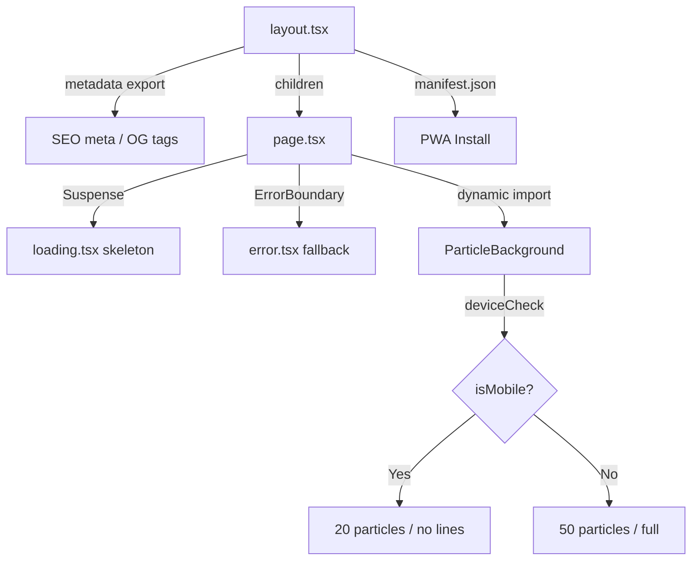
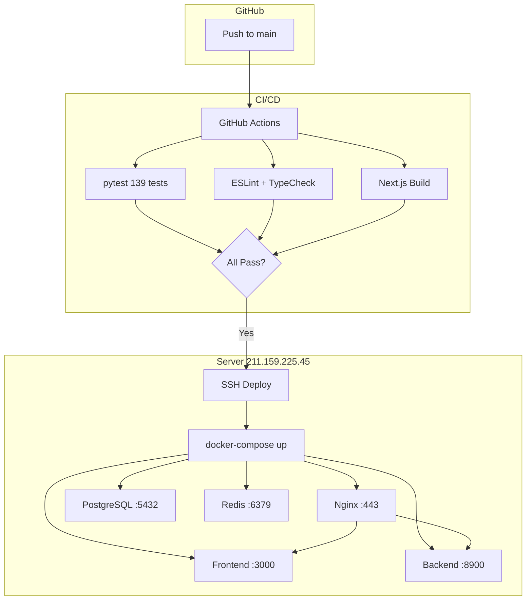
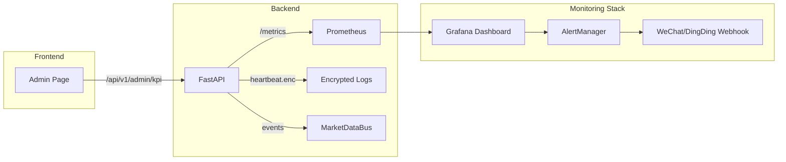

# OmniEdge (全域工联) — 项目改进方案

> 基于对整个代码库的深度审计，以下 5 份改进方案按 **投资回报率** 排序，每份独立可执行。

---

## 方案 A：品牌一致性 + 残留清理（TradeStealth → OmniEdge）

### 问题诊断

前端 UI 和 AI System Prompt 已完成品牌切换，但基础设施层仍残留大量 `TradeStealth` 引用：

| 文件 | 残留内容 |
|------|----------|
| `docker-compose.prod.yml` | `tradestealth-backend`, `tradestealth-postgres`, `tradestealth-redis`, DB名 `tradestealth` |
| `Dockerfile.backend` | 顶部注释 `TradeStealth_Core` |
| `.env.example` | 标题 `TradeStealth_Core`、`MACHINE_SECRET_SALT=TradeStealth_v1_salt` |
| `requirements.txt` | 顶部注释 `TradeStealth_Core` |
| `main.py` | docstring `TradeStealth_Core`、日志 `Project Claw 暗箱平台` |
| `src/core/security.py` | `MACHINE_SECRET_SALT` 默认值 `TradeStealth_v1_salt` |
| `src/database/models.py` | `DATABASE_URL` 默认值含 `tradestealth` |

### 改进内容

- [ ] 全局替换 Docker/Infra 层品牌名为 `omniedge`
- [ ] 更新 `.env.example` 所有注释和默认值
- [ ] 更新 `requirements.txt` 头部注释
- [ ] 更新 `main.py` docstring 和启动日志
- [ ] 更新 `security.py` 默认盐值为 `OmniEdge_v1_salt`
- [ ] 更新 `models.py` 默认 DATABASE_URL
- [ ] 确保所有 139 个测试通过

### 影响范围

纯文本/配置更改，零功能影响，零风险。

---

## 方案 B：Next.js 性能优化 + SEO + PWA

### 问题诊断

`next.config.ts` 当前完全为空，没有任何优化配置：

```ts
const nextConfig: NextConfig = {
  /* config options here */
};
```

已发现的性能问题：
1. 无图片优化（`next/image` 未使用）
2. 无 PWA manifest（移动端无法安装到桌面）
3. 无 SEO meta tags（`layout.tsx` 缺少 `metadata` 导出）
4. 无 `loading.tsx` / `error.tsx` 路由级文件
5. 首页 `ParticleBackground` 每帧渲染 50 粒子 + 连线，移动端性能差
6. Three.js GlobeVisualization 未做设备降级

### 改进内容

- [ ] 配置 `next.config.ts`：启用 `output: 'standalone'`、`images` 优化、`compress: true`
- [ ] 添加 `metadata` 导出到 `layout.tsx`（OG tags、favicon、description）
- [ ] 为每个路由添加 `loading.tsx`（骨架屏/Bloomberg 风格加载动画）
- [ ] 为每个路由添加 `error.tsx`（优雅降级界面）
- [ ] 粒子背景添加 `devicePixelRatio` 适配和移动端粒子数量降级
- [ ] 添加 `manifest.json` 支持 PWA 安装
- [ ] Globe 组件添加 `matchMedia('prefers-reduced-motion')` 检测

### 架构图



---

## 方案 C：前后端 API 真实对接（消灭 Mock 数据）

### 问题诊断

前端 4 个页面**全部使用 mock 数据**，与后端 FastAPI 完全断开：

| 页面 | 现状 | 后端 API |
|------|------|----------|
| Homepage | `TickerTape` 硬编码 8 个假 ticker | `/api/v1/askb/query` 已就绪 |
| Buyer | `MOCK_SKUS` 硬编码 6 个 SKU，`handleFlashOrder` 用 `setTimeout` 模拟 | `/api/v1/buyer/inquire` + `/api/v1/buyer/flash-intent` 已就绪 |
| Merchant | mock `pnl` 随机数，无真实 SSE | `/api/v1/merchant/stream` SSE 已就绪 |
| Admin | `MOCK_KPIS` 硬编码，`AuditLogStream` mock 数据 | 无现成 API，需新建 |

`axios-client.ts`、`sse-client.ts`、`ws-client.ts` 三个客户端工具已编写就绪但**未被任何页面使用**。

### 改进内容

- [ ] Buyer 页面：接入 `/api/v1/buyer/flash-intent` 替换 `setTimeout` mock
- [ ] Buyer 页面：接入 `/api/v1/buyer/inquire` 实现真实 SKU 搜索
- [ ] Merchant 页面：接入 `/api/v1/merchant/stream` SSE 替换 mock PnL
- [ ] Merchant 页面：接入 `WSClient` 实现真实 tick feed
- [ ] Homepage：TickerTape 从后端拉取真实 ticker 注册表数据
- [ ] Admin 页面：新建 `/api/v1/admin/kpi` API 端点返回真实 KPI
- [ ] Admin 页面：`AuditLogStream` 接入真实审计日志 API
- [ ] 添加 `.env.local` 配置 `NEXT_PUBLIC_API_BASE_URL` 指向服务器

### 数据流架构

```mermaid
graph LR
    subgraph Frontend - Next.js
        B[Buyer Page]
        M[Merchant Page]
        A[Admin Page]
        H[Homepage]
    end

    subgraph API Clients
        AX[axios-client]
        SSE[sse-client]
        WS[ws-client]
    end

    subgraph Backend - FastAPI
        F1[/buyer/flash-intent]
        F2[/buyer/inquire]
        F3[/merchant/stream SSE]
        F4[/admin/kpi NEW]
        F5[/askb/query]
    end

    B --> AX --> F1
    B --> AX --> F2
    M --> SSE --> F3
    M --> WS --> F5
    A --> AX --> F4
    H --> AX --> F5
```

---

## 方案 D：DevOps 管线 + Docker 生产化

### 问题诊断

1. **无 CI/CD**：无 GitHub Actions，代码质量依赖手工 `pytest`
2. **部署靠 scp**：每次改文件手动 scp → ssh → build → pm2 restart
3. **Docker 未含前端**：`docker-compose.prod.yml` 只有 backend + postgres + redis，前端靠 PM2 裸跑
4. **默认密码**：`POSTGRES_USER/PASSWORD` 都是 `postgres`
5. **无健康检查端点**：后端无 `/health` 路由
6. **无 Nginx 配置文件**：Nginx 反代配置不在版本控制中

### 改进内容

- [ ] 新建 `Dockerfile.frontend` — Next.js standalone 构建
- [ ] 更新 `docker-compose.prod.yml` — 添加 frontend service + nginx reverse proxy
- [ ] 新建 `.github/workflows/ci.yml` — lint + test + build 自动化
- [ ] 新建 `.github/workflows/deploy.yml` — SSH deploy on push to main
- [ ] 后端添加 `/health` 端点（DB ping + Redis ping + uptime）
- [ ] 新建 `nginx/omniedge.conf` — HTTPS + WebSocket 反代 + gzip
- [ ] 将 Postgres 密码移入 `.env` 不硬编码
- [ ] 添加 `deploy-docker.sh` 一键部署脚本

### 部署架构



---

## 方案 E：Observability 监控面板 + 告警

### 问题诊断

1. `HeartbeatMonitor` 每 10 秒写 AES 加密心跳到 `logs/heartbeat_YYYYMMDD.enc`，但**无任何工具解密查看**
2. `MarketDataBus` 有丰富的事件流但**无 metrics 暴露**
3. `IdempotencyGuard` 的拦截统计无法观测
4. `OpponentProfiler` 画像更新无聚合仪表盘
5. 后端无 Prometheus metrics 端点
6. 前端 Admin 页面 KPI 全是假数据

### 改进内容

- [ ] 新建 `src/monitor/metrics.py` — Prometheus 指标收集器
  - `omniedge_trades_total` Counter（按状态分）
  - `omniedge_arbitrage_spread_pct` Histogram
  - `omniedge_idempotency_rejections_total` Counter
  - `omniedge_active_negotiations` Gauge
  - `omniedge_llm_latency_seconds` Histogram
- [ ] 后端添加 `/metrics` Prometheus endpoint
- [ ] `docker-compose.prod.yml` 添加 Prometheus + Grafana services
- [ ] 新建 `grafana/dashboards/omniedge-overview.json` — 预配置仪表盘
- [ ] 新建 `src/monitor/decrypt_heartbeat.py` — 心跳日志解密查看工具
- [ ] Admin 前端页面接入真实 metrics API 替换 mock KPI
- [ ] 添加告警规则：交易失败率 > 10%、LLM 延迟 > 5s、DB 连接池耗尽

### 监控架构



---

## 对比总结

| 方案 | 复杂度 | 风险 | 价值 | 建议优先级 |
|------|--------|------|------|-----------|
| **A: 品牌清理** | ⭐ | 极低 | 品牌统一、投资人/客户信任 | 🥇 立即执行 |
| **B: Next.js 优化** | ⭐⭐ | 低 | 性能/SEO/移动端体验 | 🥈 紧随其后 |
| **C: API 真实对接** | ⭐⭐⭐ | 中 | 产品可用性质变 | 🥉 核心工作 |
| **D: DevOps 管线** | ⭐⭐⭐ | 中 | 部署效率/代码质量保障 | 4th |
| **E: 监控告警** | ⭐⭐⭐⭐ | 低 | 生产运维可观测性 | 5th |

---

*Generated: 2026-04-09 | Based on full codebase audit of OmniEdge (全域工联)*
