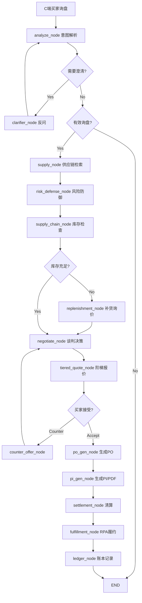

# Project Claw 工业级升级计划

## 现状分析

当前 TradeStealth_Core 已实现的核心能力：

- LangGraph 工作流编排：`analyze_node` → 条件路由 → `draft_node`（邮件意图解析 + 回信生成）
- 供应链撮合引擎：`demand_node` → `supply_node` → `risk_defense_node` → `negotiate_node` → `po_gen_node`
- 风险防御：价格波动熔断（PriceVolatilityMonitor）+ 库存 Agent 校验（InventoryAgent）
- 谈判决策树：MOQ/认证/预算/贸易术语 四层决策
- 交易账本：SHA256 签名 + 路由费自动扣费
- RPA 暗箱：Playwright Stealth 反检测浏览器（登录/发邮件/线索抓取）
- 文档生成：报价单/PI/合同 AI 生成 + AES 加密存储
- 外汇服务：Mock 汇率 + 落地成本计算
- PyQt6 控制面板 + God Dashboard 融资演示大屏

## Gemini 建议提取的关键改进方向

从 Gemini 总结中提取 7 个核心升级维度，按依赖关系排序：

---

## Phase 1: TradeState 扩展 + RFQ Agent 结构化

### 1.1 扩展状态模型

目标文件：[`src/agents/state.py`](src/agents/state.py) + [`src/modules/supply_chain/matching_graph.py`](src/modules/supply_chain/matching_graph.py)

当前 `TradeState` 仅有 4 个字段，`MatchState` 有 7 个字段。需要扩展以支撑完整交易生命周期：

```python
# TradeState 新增字段
negotiation_status: str        # pending / counter_offer / accepted / rejected
tiered_quotes: list[dict]      # 阶梯报价列表
contract_state: dict            # PI/合同状态
fulfillment_state: dict         # 履约跟踪状态
clarification_needed: bool      # 是否需要反问澄清
clarification_questions: list   # 待澄清问题列表
```

### 1.2 升级 C 端意图解析为"AI 标准意图表"

目标文件：[`src/agents/c_intent_agent.py`](src/agents/c_intent_agent.py)

当前 `_INTENT_SYSTEM_PROMPT` 提取 7 个字段。升级为外贸标准 RFQ 结构：

```python
# 新增提取字段
"moq_preference": "买家期望的起订量",
"trade_term": "FOB / CIF / EXW / DDP",
"target_port": "目标港口",
"certs_required": ["CE", "FCC", "RoHS", "UL", "IEC", "TUV"],
"voltage_spec": "电压规格（如适用）",
"payment_preference": "T/T / L/C / D/P",
"sample_needed": true/false,
"delivery_deadline": "期望交货日期"
```

### 1.3 增加意图澄清节点

目标文件：新建 `src/agents/intent_clarifier.py`

当需求模糊时（如缺少电压规格、未指定认证），Agent 自动生成反问列表：

```
工作流变更：
START → analyze_node → [needs_clarification?]
                         ├─ True  → clarifier_node → analyze_node（重入）
                         └─ False → [is_valid_lead?] → ...
```

---

## Phase 2: 阶梯报价 + 动态谈判流

### 2.1 TieredQuoteEngine

目标文件：[`src/modules/supply_chain/negotiator.py`](src/modules/supply_chain/negotiator.py)

当前 `NegotiatorAgent` 只输出单一 best_match。升级为阶梯报价引擎：

```python
class TieredQuoteEngine:
    """生成阶梯报价看板"""
    def generate_tiers(self, candidate, demand) -> list[dict]:
        return [
            {"option": "A", "moq": 500,   "unit_price_usd": 15.0, "prepay_pct": 0},
            {"option": "B", "moq": 5000,  "unit_price_usd": 13.0, "prepay_pct": 0},
            {"option": "C", "moq": 10000, "unit_price_usd": 12.0, "prepay_pct": 30},
        ]
```

### 2.2 NegotiationLoop 状态机

目标文件：新建 `src/modules/supply_chain/negotiation_state.py`

支持多轮谈判状态流转：

```
Pending → Counter-offer → Accepted
                ↓
           Rejected → END
```

每轮报价变动高亮差值（如：$1.50 → $1.42，降幅 5.3%）。

新增数据模型 `NegotiationRound` 表：

```python
class NegotiationRound(Base):
    __tablename__ = "negotiation_rounds"
    id: str
    match_id: str
    round_number: int
    status: str          # pending / counter_offer / accepted / rejected
    buyer_offer: dict    # 买家出价
    seller_offer: dict   # 卖家报价
    delta_highlight: dict # 差值高亮
    created_at: datetime
```

### 2.3 工作流集成

目标文件：[`src/modules/supply_chain/matching_graph.py`](src/modules/supply_chain/matching_graph.py)

在 `negotiate_node` 之后、`po_gen_node` 之前插入 `tiered_quote_node`：

```
negotiate_node → tiered_quote_node → [buyer_accepts?]
                                       ├─ Yes → po_gen_node → END
                                       └─ No  → counter_offer_node → negotiate_node（循环）
```

---

## Phase 3: 合同与履约自动化

### 3.1 PI 模板引擎

目标文件：[`src/modules/core_module/doc_generator.py`](src/modules/core_module/doc_generator.py)

当前 `DocGenerator` 用 LLM 自由生成文本。升级为结构化模板引擎：

- PI 模板：自动填充 buyer/seller info、itemized list、banking details、shipping terms
- 合同模板：parties、scope、pricing、delivery、warranty、dispute resolution
- 基于 `TradeState` + `NegotiationResult` 自动填充所有字段

### 3.2 PDF 生成

新增依赖：`reportlab` 或 `weasyprint`

```python
class PIGenerator:
    """Proforma Invoice PDF 生成器"""
    def generate_pdf(self, trade_state: dict, negotiation: dict) -> bytes:
        # 基于模板生成正式 PDF
        # 包含：发票号、日期、买卖双方、商品明细、贸易术语、付款条件、物流信息
        pass
```

### 3.3 Webhook 通知

目标文件：新建 `src/modules/core_module/webhook_notifier.py`

成交后自动推送：
- PI PDF 发送至商家 ERP（通过 Webhook POST）
- 邮件通知买家（通过 RPA 或 SMTP）
- 电子签名跳转链接

---

## Phase 4: 供应链集成 (SupplyChainNode)

### 4.1 供应商知识库接入

目标文件：[`src/agents/agent_workflow.py`](src/agents/agent_workflow.py)

新增 `SupplyChainNode`：

```python
class SupplyChainNode:
    """供应链库存检查 + 补货决策"""
    def check_inventory(self, sku_id: str, required_qty: int) -> dict:
        # 读取 suppliers_catalog.csv 或数据库
        # 检查原材料库存
        pass

    def generate_replenishment_order(self, shortfall: dict) -> dict:
        # 生成采购补货需求单
        pass
```

### 4.2 自动补货逻辑

当 B 端 Agent 收到大额订单（quantity > stock_qty * 0.8）时：
1. 自动调用 `SupplyChainNode.check_inventory()`
2. 库存不足 → 生成"采购补货需求单"
3. 发送至供应商通讯协议接口进行补货询价

### 4.3 供应商通讯接口

新建 `src/modules/supply_chain/supplier_comm.py`：

```python
class SupplierCommProtocol:
    """供应商通讯协议 — 补货询价自动化"""
    async def send_replenishment_rfq(self, supplier_id: str, items: list) -> dict:
        # 通过 Webhook / Email / API 发送补货询价
        pass
```

---

## Phase 5: RPA 暗箱履约增强

### 5.1 ContractFulfillmentTask

目标文件：[`src/rpa_engine/browser_stealth.py`](src/rpa_engine/browser_stealth.py)

当前 `StealthBrowser` 支持 login / send_email / scrape_leads 三种任务。新增：

```python
class ContractFulfillmentTask:
    """合同履约自动化任务"""
    async def execute(self, browser: StealthBrowser, params: dict) -> dict:
        # 1. 登录外贸后台
        # 2. 模拟真实表单填报（解析页面标签）
        # 3. 关键节点截图存证
        # 4. 提交订单
        pass
```

### 5.2 智能表单填报

```python
async def fill_form(self, page: Page, form_data: dict) -> dict:
    """解析页面每一项标签，智能匹配并填写"""
    # 1. 获取所有 input/select/textarea 元素
    # 2. 通过 label/name/placeholder 匹配字段
    # 3. 逐字段填写（模拟人类输入节奏）
    pass
```

### 5.3 截图存证 + Hash 校验

```python
async def capture_proof(self, page: Page, step_name: str) -> dict:
    """关键节点截图 + SHA256 Hash 校验"""
    screenshot_path = f"logs/proof/{step_name}_{timestamp}.png"
    await page.screenshot(path=screenshot_path, full_page=True)
    file_hash = hashlib.sha256(open(screenshot_path, 'rb').read()).hexdigest()
    return {"path": screenshot_path, "hash": file_hash, "step": step_name}
```

---

## Phase 6: 跨境金融清算

### 6.1 CurrencyConverter 升级

目标文件：[`src/modules/supply_chain/fx_service.py`](src/modules/supply_chain/fx_service.py)

当前使用 `_MOCK_RATES` 硬编码汇率。升级为：

```python
class CurrencyConverter:
    """实时汇率转换器"""
    async def get_live_rate(self, from_ccy: str, to_ccy: str) -> float:
        # 优先调用 Forex API（exchangerate-api.com / openexchangerates.org）
        # 失败时回退到 mock 数据
        pass
```

### 6.2 CrossBorderPayment 接口

新建 `src/modules/supply_chain/clearing_service.py`：

```python
class CrossBorderPayment:
    """跨境支付清算网关"""
    async def create_payment_intent(self, amount_cny: float, buyer_currency: str) -> dict:
        # 集成 Stripe Connect 或 Airwallex API
        # B 端以人民币报价，C 端按美元/欧元结算
        pass

    def build_transparent_quote(self, price_cny: float, fx_rate: float) -> dict:
        return {
            "price_cny": price_cny,
            "fx_rate": fx_rate,
            "price_usd": round(price_cny / fx_rate, 2),
        }
```

### 6.3 报价双币透明化

所有报价回复必须附带：

```json
{
    "price_cny": 100,
    "fx_rate": 7.2,
    "price_usd": 13.89
}
```

修改 [`negotiator.py`](src/modules/supply_chain/negotiator.py) 的 `_evaluate_candidate()` 输出格式。

---

## Phase 7: 信任雷达 + API 扩展

### 7.1 TrustRadar 模型

新建 `src/modules/supply_chain/trust_radar.py`：

```python
class TrustRadar:
    """供应商信任雷达图数据引擎"""
    dimensions = [
        "industry_qualification",   # 行业资质
        "transaction_volume",       # 过往成交量
        "response_speed",           # 响应速度
        "certification_coverage",   # 认证证书覆盖率
        "delivery_reliability",     # 交付可靠性
    ]

    async def calculate(self, supplier_id: str) -> dict:
        # 从 TransactionLedger + Supplier + MatchResult 聚合计算
        pass
```

### 7.2 API 端点扩展

目标文件：[`main.py`](main.py)

新增 RESTful 端点：

| 端点 | 方法 | 功能 |
|------|------|------|
| `/api/v1/match` | POST | 供应链撮合入口 |
| `/api/v1/negotiate` | POST | 发起/响应谈判 |
| `/api/v1/quote/tiered` | GET | 获取阶梯报价 |
| `/api/v1/contract/pi` | POST | 生成 PI |
| `/api/v1/contract/pdf` | GET | 下载 PI PDF |
| `/api/v1/settlement/create` | POST | 创建清算 |
| `/api/v1/supplier/trust` | GET | 获取信任雷达 |

### 7.3 Supplier 信任评分引擎

扩展 [`models.py`](src/modules/supply_chain/models.py) 中的 `Supplier` 模型：

```python
# 新增字段
total_transactions: int          # 历史成交笔数
avg_response_hours: float        # 平均响应时间（小时）
delivery_on_time_rate: float     # 准时交付率
trust_score: float               # 综合信任评分 0-100
last_trust_update: datetime      # 最近一次评分更新
```

---

## 架构变更总览



## 新增文件清单

| 文件路径 | 用途 |
|----------|------|
| `src/agents/intent_clarifier.py` | 意图澄清反问节点 |
| `src/modules/supply_chain/tiered_quote.py` | 阶梯报价引擎 |
| `src/modules/supply_chain/negotiation_state.py` | 谈判状态机 + NegotiationRound 模型 |
| `src/modules/supply_chain/supplier_comm.py` | 供应商通讯协议 |
| `src/modules/supply_chain/clearing_service.py` | 跨境支付清算网关 |
| `src/modules/supply_chain/trust_radar.py` | 信任雷达评分引擎 |
| `src/modules/core_module/pi_generator.py` | PI PDF 生成器 |
| `src/modules/core_module/webhook_notifier.py` | Webhook 通知服务 |

## 修改文件清单

| 文件路径 | 改动范围 |
|----------|----------|
| `src/agents/state.py` | 扩展 TradeState 字段 |
| `src/agents/c_intent_agent.py` | 升级 RFQ 结构化提取 prompt |
| `src/agents/workflow_graph.py` | 增加 clarifier 节点 + 路由 |
| `src/agents/agent_workflow.py` | 增加 SupplyChainNode |
| `src/modules/supply_chain/negotiator.py` | 集成 TieredQuoteEngine |
| `src/modules/supply_chain/matching_graph.py` | 扩展工作流节点 |
| `src/modules/supply_chain/models.py` | 新增 NegotiationRound 表 + Supplier 信任字段 |
| `src/modules/supply_chain/fx_service.py` | 升级为实时汇率 + 双币报价 |
| `src/modules/core_module/doc_generator.py` | 集成 PI 模板引擎 |
| `src/rpa_engine/browser_stealth.py` | 增加 ContractFulfillmentTask + 截图存证 |
| `main.py` | 新增 API 端点 |
| `requirements.txt` | 新增 reportlab / httpx 等依赖 |

## 实施优先级

Phase 1-2 为核心交易范式升级，直接影响撮合转化率，建议优先实施。
Phase 3 为成交后自动化，Phase 4-5 为供应链深度集成，Phase 6-7 为金融与信任体系。
